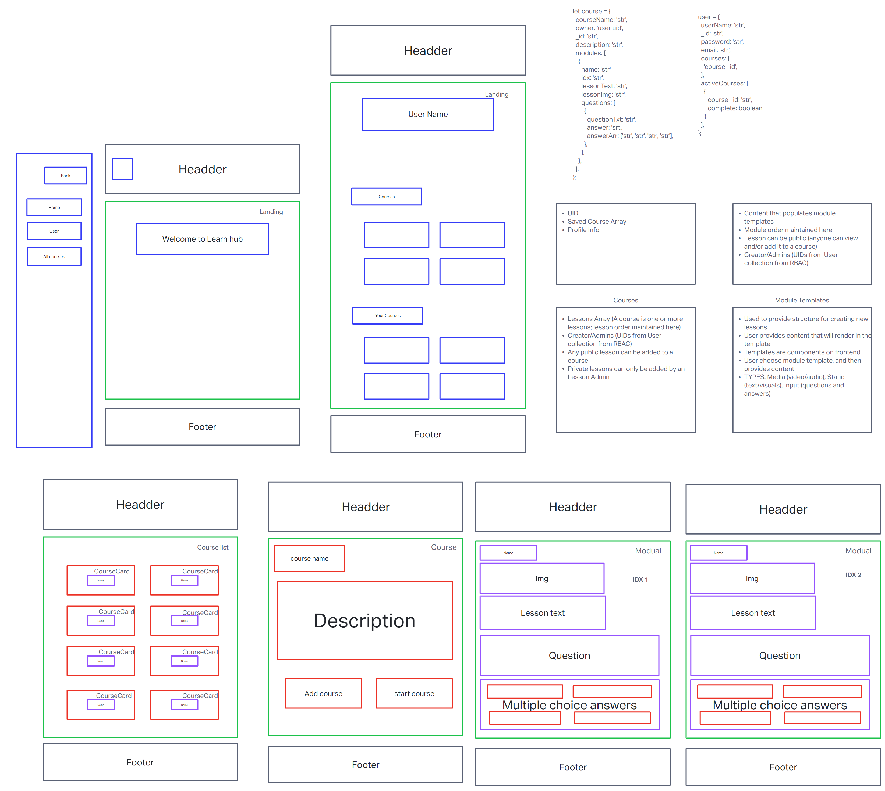

# Learnhub

## Team Members

- Martin Hansen
- Jonathan Staib
- Brandon Perard
- Ty Aponte
- Marco Villafana

## Mission

Our mission at LearnHub is to provide free and accessible online learning for all, fostering creativity, critical thinking, and lifelong learning, empowering individuals to unlock their potential and make a positive impact on the world.

## Overview

Learnhub is a full-stack application created to provide a web platform that allows users to create, share, and learn from courses. Learnhub uses React with Redux & Mantine on the frontend, a Node.js Express server on the backend, and a NoSQL Mongo database with Mongoose.

## Process and Documentation

[Team Agreement](./team-agreement.md)  
[Software Requirements](./software-requirements)  

